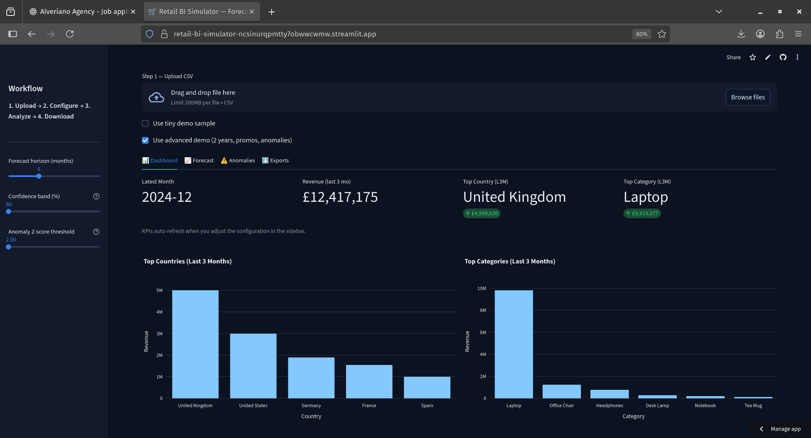
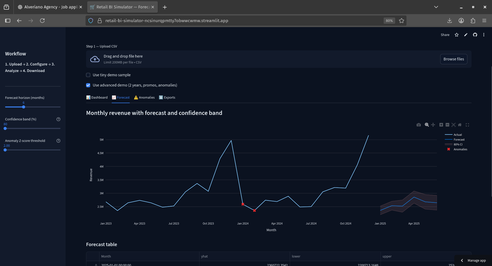
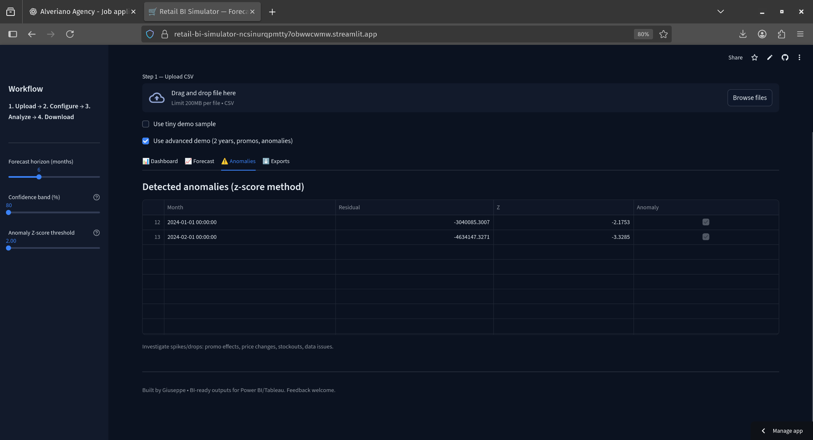
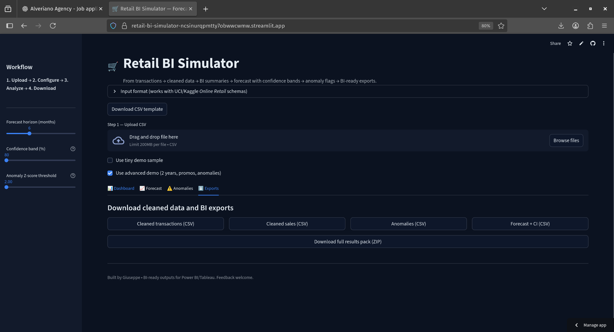

# 🛒 Retail BI Simulator

Turn raw retail transactions → **clean data, BI summaries, forecast with confidence bands, anomaly flags**, and **BI-ready exports** (CSV & SQLite) in minutes. Built to mirror a grad BI developer’s real workflow.

## 🔎 Screenshots

   <em>Executive KPIs + Top Countries/Categories</em>

   <em>Monthly revenue with forecast & confidence band</em>

   <em>Z-score anomaly detection on residuals</em>

   <em>One-click downloads (cleaned data, anomalies, forecast, ZIP pack)</em>

