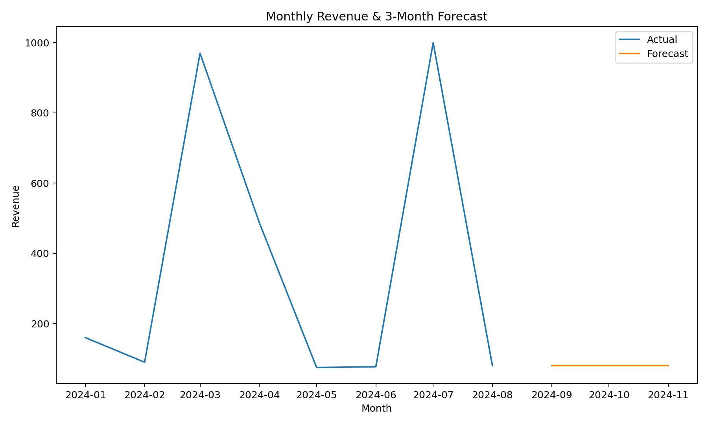

# 🛒 Retail BI Simulator


**Business context:** Retailers sit on messy transaction logs. Turning them into **business-ready insights** is the day-one job of BI & Data Analysts.  

This project simulates a full BI workflow end-to-end:  
- ✅ Cleans raw retail transactions  
- ✅ Aggregates into **monthly sales by country & category**  
- ✅ Forecasts next 3 months of revenue with **confidence bands**  
- ✅ Detects anomalies (outlier months)  
- ✅ Exports a BI-ready dataset (**CSV + SQLite**) for **Power BI/Tableau**  
- ✅ Builds a **dashboard (HTML)** and **executive summary report**  

---

## 📊 Example Outputs

**1. Forecast chart with confidence bands**  
<p align="center"></p>

**2. Anomaly detection**  
👉 [`outputs/bi_exports/anomalies.csv`](./outputs/bi_exports/anomalies.csv)  

**3. Executive report (excerpt)**  

# Retail BI — Executive Summary

* Top country (last 3 months): United Kingdom — revenue £1,140
* Top category (last 3 months): Notebook — revenue £715
* Next 3 months forecast (point total): £3,350
* Anomalies detected: Dec 2010 (spike), Jun 2011 (drop)

Implications:

* Investigate anomalies (promo spike? stockout?)
* Use forecast CI bands for safer planning

````

**4. Interactive dashboard**  
👉 [bi_dashboard.html](./outputs/bi_dashboard.html) (open locally)  

**5. BI-ready exports**  
- `outputs/bi_exports/fact_sales.csv` — fact table  
- `outputs/bi_exports/dim_date.csv` — date dimension  
- `outputs/retail_bi.sqlite` — SQLite DB  

---

## 🚀 How to Run

1. Clone repo & install deps:
   ```bash
   git clone https://github.com/Giuseppe552/retail-bi-simulator.git
   cd retail-bi-simulator
   pip install -r requirements.txt
   ````

2. Run with a CSV file (`InvoiceDate, Quantity, UnitPrice, Country, Description`):

   ```bash
   python3 retail_bi.py data/transactions.csv
   ```

3. Outputs in `outputs/`:

   * `cleaned_sales.csv` — cleaned + aggregated
   * `forecast.png` — forecast chart with CI bands
   * `bi_dashboard.html` — interactive dashboard
   * `report.txt` — exec summary
   * `bi_exports/` — BI-ready tables & anomalies
   * `retail_bi.sqlite` — SQLite DB (load into Power BI/Tableau)

---


